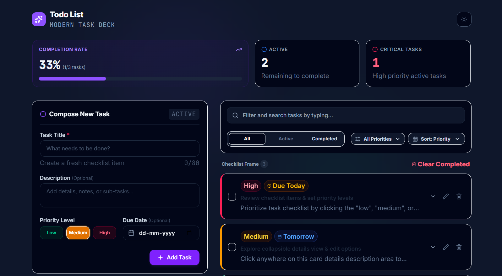
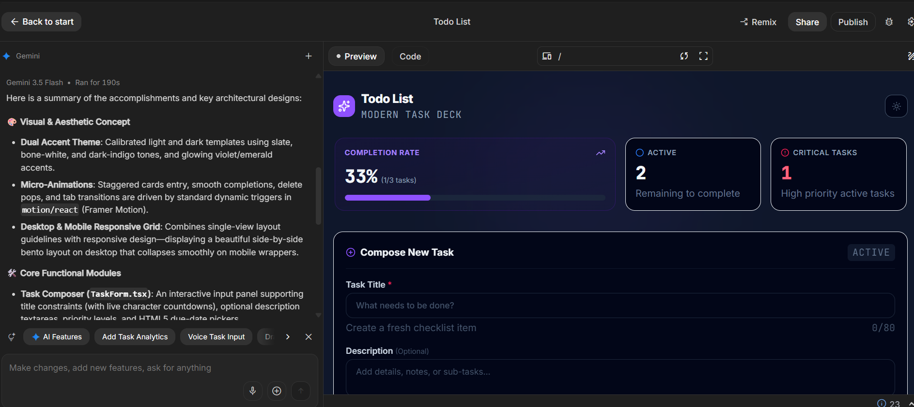
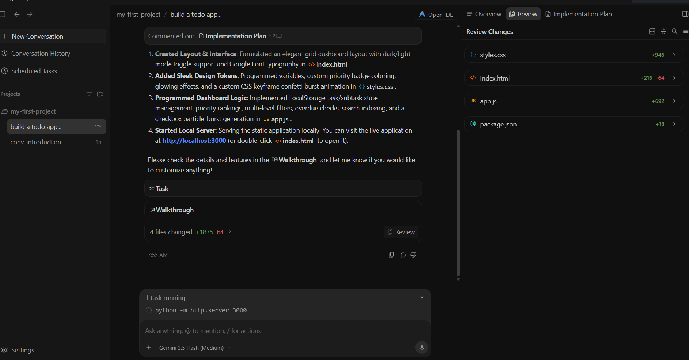

<div align="center">
# 🚀 Day 1 — Introduction to AI Agents & Vibe Coding

<div align="center">

### Google AI Agents Intensive Program

Building and deploying my first AI-generated web application using Google AI Studio.


</div>

---

# 📖 Overview

Day 1 introduced the fundamentals of AI Agents and Vibe Coding through a hands-on project built with Google AI Studio.

The objective was to experience AI-assisted software development by generating a complete web application using natural language prompts and then testing, refining, and deploying the result.

The outcome was a modern Todo Application featuring task management, search functionality, theme switching, and a responsive user interface.

---

# 🎯 Learning Objectives

* Understand the basics of AI Agents
* Explore Vibe Coding workflows
* Learn AI-assisted application development
* Generate a complete project using Google AI Studio
* Test and run a generated application locally
* Deploy an application using AI Studio

---

# 🛠️ What I Built

## PriorityFlow Todo Application

A modern and responsive task management application generated using Google AI Studio.

### Features

* ✅ Create Tasks
* ✅ Edit Tasks
* ✅ Delete Tasks
* ✅ Search Tasks
* ✅ Category Organization
* ✅ Due Date Tracking
* ✅ Theme Toggle (Light/Dark Mode)
* ✅ Responsive UI
* ✅ Local State Persistence

---

# 📂 Project Structure

```text
my-first-project/
│
├── index.html
├── styles.css
├── app.js
├── package.json
└── screenshots/
```

---

# 💻 Technologies Used

| Category        | Technology       |
| --------------- | ---------------- |
| Frontend        | HTML             |
| Styling         | CSS              |
| Logic           | JavaScript       |
| AI Development  | Google AI Studio |
| Version Control | Git & GitHub     |

---

# 🧠 What I Learned

### AI-Assisted Development

Learned how modern AI tools can generate complete application structures from natural language prompts.

### Prompt Iteration

Improved results through iterative prompting and refinement.

### Frontend Fundamentals

Explored how HTML, CSS, and JavaScript work together in a real project.

### Application Testing

Learned how to run, inspect, and validate a generated application locally.

### AI Studio Deployment

Published an AI-generated application through Google AI Studio.

---

# 📸 Screenshots

## 🏠 Todo Dashboard

Main application dashboard showing task management functionality.



---

## 🎨 AI Studio Generated Application Preview

Preview of the generated application inside Google AI Studio.



---

## 🔍 AI Studio Code Review

Reviewing generated code and application structure inside AI Studio.



---

# ✅ Features Verified

* [x] Task Creation
* [x] Search Functionality
* [x] Theme Toggle
* [x] Responsive Layout
* [x] Local Application Execution
* [x] AI Studio Publishing Workflow

---

# 💡 Key Takeaways

* AI can generate complete application structures from natural language instructions.
* Iterative prompting significantly improves generated results.
* Understanding generated code remains important even when AI writes it.
* AI-assisted development can dramatically accelerate prototyping.
* Google AI Studio provides an effective environment for rapid experimentation.

---

# 💭 Reflection

Day 1 demonstrated how AI is transforming software development workflows.

Rather than starting from a blank editor, developers can collaborate with AI systems to rapidly generate, refine, and deploy applications. This experience highlighted both the speed and potential of AI-assisted development while reinforcing the importance of understanding the generated code.

---

<div align="center">

## 🌟 Day 1 Successfully Completed

*"The fastest way to learn AI-assisted development is to build something with it."*

</div>
