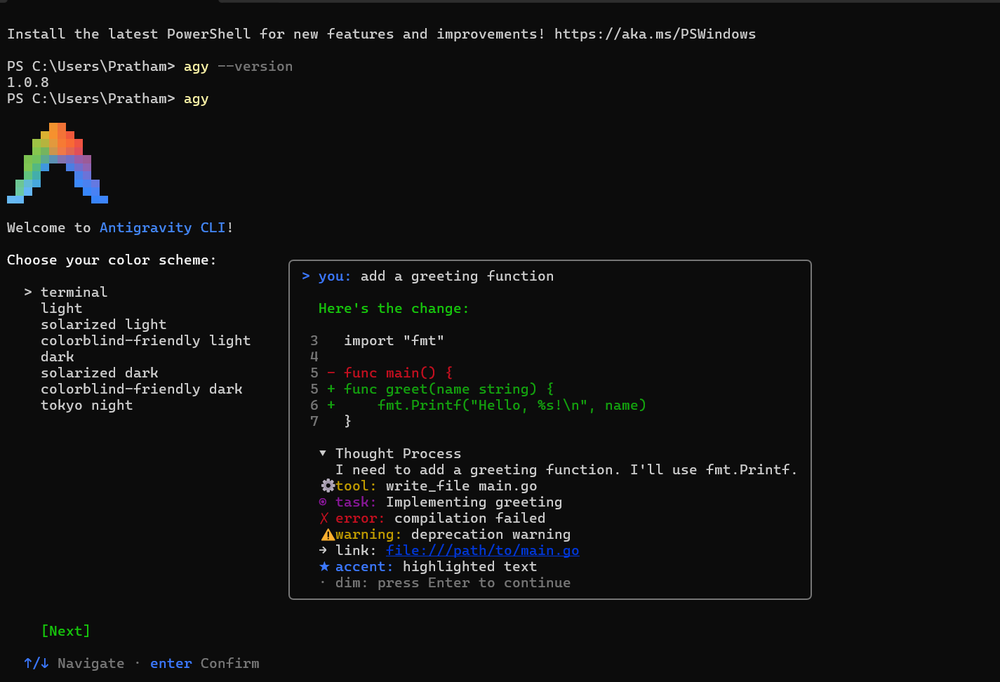
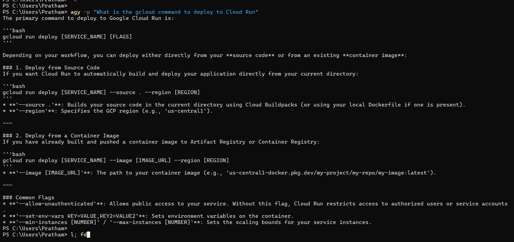
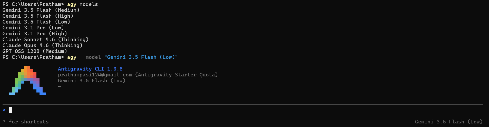
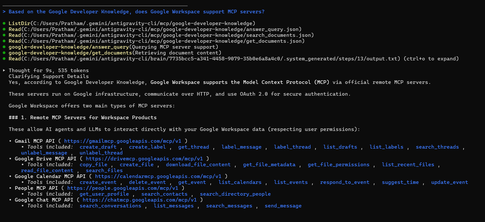
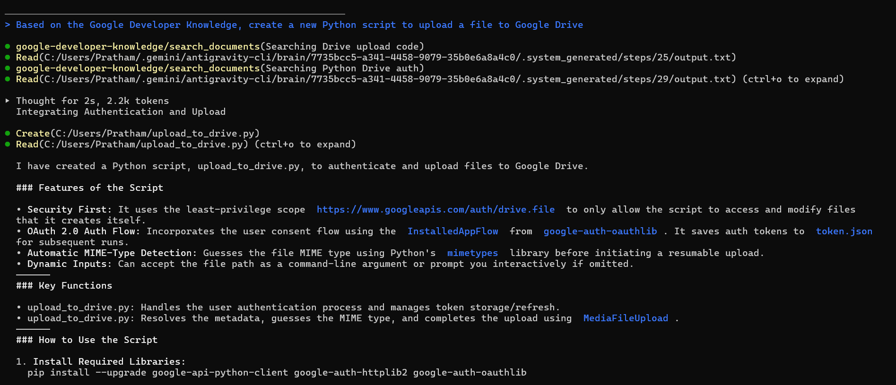
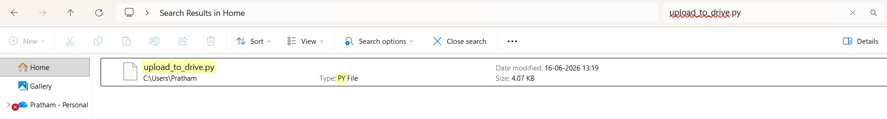

# 🚀 Day 2 — Agent Tools & Interoperability

<div align="center">

### Google AI Agents Intensive Program

*Exploring how AI Agents connect to tools, data sources, and external systems through open interoperability standards.*


</div>

---

## 📖 Overview

Day 2 focused on one of the most important aspects of modern AI systems: **tool usage and interoperability**.

While large language models are powerful reasoning engines, their real-world usefulness increases dramatically when they can interact with external systems, APIs, documentation sources, and software tools.

The goal of this unit was to understand how open standards such as the **Model Context Protocol (MCP)** help create a plug-and-play ecosystem where AI agents can securely discover, access, and use external capabilities.

Through hands-on exercises with Antigravity CLI and the Google Developer Knowledge MCP Server, I learned how AI agents retrieve trusted information directly from machine-readable documentation rather than relying solely on model memory.

---

# 🎯 Day 2 Objectives

* ✅ Understand Agent Tools and Interoperability.
* ✅ Learn the fundamentals of Model Context Protocol (MCP).
* ✅ Explore how AI agents connect to external knowledge sources.
* ✅ Install and use Antigravity CLI.
* ✅ Configure and test MCP servers.
* ✅ Query Google Developer Knowledge using natural language.
* ✅ Generate code using documentation-aware AI workflows.
* ✅ Document the learning journey.

---

# 📚 Learning Resources Completed

## 🎧 Summary Podcast

**Agent Tools & Interoperability**

> A discussion on open protocols, agent ecosystems, MCP, A2A communication, and the future of interoperable AI systems.

---

## 📄 Whitepaper

### *Agent Tools & Interoperability*

The whitepaper explored how modern AI systems communicate with external tools and services through standardized protocols.

Key topics included:

* Model Context Protocol (MCP)
* Agent-to-Agent Communication (A2A)
* Agent-to-User Interface (A2UI)
* Agent Payments Protocol (AP2)
* Universal Commerce Protocol (UCP)

---

# 🧪 Hands-On Assignments Completed

## 1️⃣ Get Started with Antigravity CLI

### Official Codelab

https://codelabs.developers.google.com/antigravity-cli-hands-on#0

### Completed Activities

* Installed Antigravity CLI.
* Configured API access.
* Explored terminal-based AI workflows.
* Learned prompt-driven development from the command line.
* Executed AI-assisted tasks using natural language instructions.

---

## 2️⃣ Explore Google Developer Knowledge MCP Server

### Official Codelab

https://codelabs.developers.google.com/developer-knowledge-mcp-antigravity

### Completed Activities

* Added the Google Developer Knowledge MCP Server.
* Connected Antigravity CLI to external documentation.
* Queried Google Developer resources using natural language.
* Retrieved API information from authoritative sources.
* Generated implementation guidance using MCP-powered workflows.

---

# 🛠️ Practical Exercises

## MCP Query 1

### Prompt

```text
Based on the Google Developer Knowledge, does Google Workspace support MCP servers?
```

### Outcome

Learned that Google Workspace provides official MCP-compatible services, including:

* Gmail MCP API
* Google Drive MCP API
* Google Calendar MCP API
* Google Chat MCP API
* Google People API

These services allow AI agents to securely interact with Workspace resources using OAuth-based authentication.

---

## MCP Query 2

### Prompt

```text
Give me a list of the Google Workspace and Cloud Run API names. Make it super short.
```

### Outcome

Retrieved API service names directly from Google documentation, including:

* gmail.googleapis.com
* drive.googleapis.com
* calendar.googleapis.com
* chat.googleapis.com
* people.googleapis.com
* run.googleapis.com

---

## MCP Query 3

### Prompt

```text
Based on the Google Developer Knowledge, create a new Python script to upload a file to Google Drive
```

### Outcome

Generated a complete Google Drive upload script using:

* OAuth 2.0 authentication
* Google Drive API
* Secure token storage
* Automatic MIME type detection

The generated code is included in:

```text
generated-code/
└── upload_to_drive.py
```

---

# 🧰 Technologies & Tools Used

| Category          | Technologies                   |
| ----------------- | ------------------------------ |
| AI Agent Platform | Antigravity CLI                |
| Knowledge Source  | Google Developer Knowledge MCP |
| Protocol          | Model Context Protocol (MCP)   |
| Language          | Python                         |
| Authentication    | OAuth 2.0                      |
| APIs              | Google Drive API               |
| Version Control   | Git & GitHub                   |

---

# 🧠 Key Concepts Learned

## 🔌 Model Context Protocol (MCP)

MCP provides a standardized method for connecting AI agents to tools, APIs, and knowledge sources.

Instead of creating custom integrations for every system, developers can expose capabilities through MCP-compatible servers.

---

## 🤝 Agent Interoperability

Interoperability enables different AI agents and systems to collaborate using shared standards and communication protocols.

---

## 📚 Documentation-Aware AI

Rather than relying solely on model training data, AI agents can access authoritative documentation in real time through MCP servers.

This improves reliability, accuracy, and developer productivity.

---

# 💭 Personal Reflection

Day 2 helped me understand that AI agents become significantly more powerful when connected to external tools and trusted knowledge sources.

The most valuable insight was learning that modern AI development is not just about prompts and models—it is increasingly about building ecosystems where agents can safely access information, execute actions, and collaborate with other systems through open standards.

Working with the Google Developer Knowledge MCP Server demonstrated how documentation can become directly accessible to AI workflows, making development faster and more reliable.

---

# 📋 Day 2 Completion Checklist

* [x] Listened to the Day 2 summary podcast.
* [x] Read the Agent Tools & Interoperability whitepaper.
* [x] Completed the Antigravity CLI codelab.
* [x] Completed the Google Developer Knowledge MCP codelab.
* [x] Connected an MCP server.
* [x] Queried developer documentation.
* [x] Generated Python code using MCP-powered knowledge retrieval.
* [x] Documented the entire learning process.

---

# 🚀 Next Steps

### Day 3 Goals

* Explore advanced agent architectures.
* Learn agent memory and reasoning workflows.
* Build more sophisticated AI-powered applications.
* Continue documenting the learning journey publicly.

---

<div align="center">

### 🌟 Day 2 Successfully Completed

**"AI becomes truly useful when it can interact with the world beyond its training data."**

</div>

## 📸 Screenshots

The following screenshots document the complete Day 2 journey, from setting up Antigravity CLI to generating a working Google Drive upload solution using MCP-powered documentation retrieval.

---

### 🤖 Antigravity CLI Setup

Successfully installed and configured Antigravity CLI, verifying that the local environment was ready for AI-assisted development workflows.



---

### 💬 First Successful CLI Query

Executed a natural language prompt to confirm that the CLI was functioning correctly and able to communicate with the configured AI model.


---

### ⚙️ AI Model Exploration

Explored the available AI models and learned how to switch between different model configurations.



---

### ☁️ Cloud Run Documentation Query

Used Antigravity CLI as a developer assistant to retrieve Google Cloud Run deployment guidance.



---

### 🔌 Google Developer Knowledge MCP Server

Connected to the Google Developer Knowledge MCP Server and successfully retrieved information directly from official Google documentation.



---

### 💻 MCP-Assisted Code Generation

Used MCP tools to search documentation, retrieve implementation details, and generate a complete Python solution.



---

### 🐍 Generated Google Drive Upload Script

Verified that the generated `upload_to_drive.py` script was successfully created and saved locally.



---
