# Day 3 – Agent Skills

## Overview

Day 3 focused on learning the fundamentals of building AI agents using Google's Agent Development Kit (ADK). The objective was to understand how agents are structured, how skills can be integrated into agent workflows, and how to run, test, and debug agents locally.

Throughout this exercise, we explored agent architecture, ADK tooling, environment setup, model configuration, and practical troubleshooting while building a **Study Buddy Agent** — a Socratic-style learning assistant powered by Gemini 2.5 Flash.

---

## 🌐 Live Demo

The Study Buddy Agent is live and accessible at:

**[https://village-unguided-flatware.ngrok-free.dev](https://village-unguided-flatware.ngrok-free.dev)**

> ⚠️ Note: This URL is served via ngrok and requires the local ADK server to be running. A permanent deployment via Google Cloud Run will be added in a future exercise.

**To run locally:**

```powershell
cd Day-3/study_buddy_agent
.venv\Scripts\activate
cd ..
adk web study_buddy_agent
```

Then open: [http://127.0.0.1:8000](http://127.0.0.1:8000)

---

## Learning Objectives

By the end of Day 3, the following concepts were understood and practiced:

- Understanding what an AI Agent is
- Understanding Agent Skills
- Using Google Agent Development Kit (ADK)
- Creating an agent project structure
- Configuring environment variables
- Connecting agents to Gemini models
- Running agents from the terminal
- Running agents using the ADK Web Interface
- Understanding root agents
- Writing effective agent instructions
- Testing conversational behavior
- Debugging common ADK issues
- Managing Python virtual environments
- Using API keys securely through `.env` files

---

## Project Built

### Study Buddy Agent

A Socratic-style learning assistant built using Google ADK.

The agent:

- Encourages active learning
- Asks guiding questions instead of giving direct answers
- Breaks complex topics into smaller, digestible concepts
- Adapts to the learner's current familiarity
- Helps students learn through guided conversation

### Agent Code

```python
from google.adk.agents import Agent

study_buddy_instruction = (
    "You are a helpful, encouraging Socratic study buddy. "
    "Your goal is to help the student learn by asking guiding questions "
    "instead of directly giving them the answers. "
    "Break down complex topics into digestible steps. "
    "If the student gets stuck, offer a hint or simplify the question. "
    "Start by asking them what topic they want to study today, "
    "and check their current familiarity with it."
)

root_agent = Agent(
    name="study_buddy",
    model="gemini-2.5-flash",
    description="A Socratic tutor agent that helps students study through interactive questioning.",
    instruction=study_buddy_instruction,
    tools=[]
)
```

### Example Conversation

```
User:    I want to study machine learning

Agent:   Excellent choice! Machine learning is a fascinating and rapidly
         evolving field. To get started, how familiar are you with machine
         learning already? For example:

         - Have you heard the term but don't know what it means?
         - Do you know the basic concept but haven't delved into it much?
         - Have you taken some courses or worked with it a bit?
         - Or is there a specific area within ML you're hoping to explore,
           like supervised learning, neural networks, or a particular algorithm?
```

---

## Skills Learned

### 1. Agent Skills Discovery

Learned how agent skills extend agent capabilities and allow agents to perform specialized tasks. Skills act as reusable, modular components that agents can invoke without duplicating logic.

**Screenshot:** `01-skills-discovery.png`

---

### 2. Antigravity CLI

Explored the Antigravity CLI and learned how it can be used for interacting with AI models and MCP integrations via the command line.

**Screenshots:** `02-antigravity-cli-first-query.png`, `03-agents-cli-version.png`

---

### 3. MCP Concepts

Learned:

- Model Context Protocol (MCP)
- Tool calling
- External integrations
- Agent-to-tool communication patterns

---

### 4. ADK Fundamentals

Learned the core building blocks of Google ADK:

- Agent structure and lifecycle
- Root agents
- Instructions and persona definition
- Model selection and configuration
- Tool registration
- Agent execution flow

**Screenshots:** `06-adk-agent-created.png`, `07-adk-agent-files-explained.png`, `08-adk-agent-explanation.png`

---

### 5. Creating a Python Helper Skill

Created a custom Python-based helper skill to understand how skills are structured and invoked within an agent ecosystem.

**Screenshots:** `04-python-helper-skill-created.png`, `05-skill-invocation.png`

---

### 6. Virtual Environment Management

Created and activated a Python virtual environment to isolate project dependencies:

```powershell
python -m venv .venv
.venv\Scripts\activate
```

**Screenshots:** `10-venv-created.png`, `11-venv-activated.png`

---

### 7. Package Installation

Installed Google ADK and all required dependencies:

```powershell
pip install google-adk
```

**Screenshot:** `12-google-adk-installed.png`

---

### 8. Environment Configuration

Configured API credentials securely via `.env`:

```env
GOOGLE_GENAI_USE_VERTEXAI=0
GOOGLE_API_KEY=YOUR_API_KEY
```

---

### 9. Running Agents

**Terminal mode:**

```powershell
adk run study_buddy_agent
```

**Web UI mode:**

```powershell
adk web study_buddy_agent
```

Then open: [http://127.0.0.1:8000](http://127.0.0.1:8000)

**Screenshot:** `13-study-buddy-agent-running-successfully.png`

---

## Project Structure

```
Day-3/
│
├── README.md
├── screenshot/
│   ├── 01-skills-discovery.png
│   ├── 02-antigravity-cli-first-query.png
│   ├── 03-agents-cli-version.png
│   ├── 04-python-helper-skill-created.png
│   ├── 05-skill-invocation.png
│   ├── 06-adk-agent-created.png
│   ├── 07-adk-agent-files-explained.png
│   ├── 08-adk-agent-explanation.png
│   ├── 09-quota-limit-reached.png
│   ├── 10-venv-created.png
│   ├── 11-venv-activated.png
│   ├── 12-google-adk-installed.png
│   └── 13-study-buddy-agent-running-successfully.png
│
├── skill/
│   └── skill.md
│
└── study_buddy_agent/
    ├── .venv/
    ├── .env
    ├── agent.py
    ├── requirements.txt
    └── __init__.py
```

---

## Screenshots

### 01 – Skills Discovery
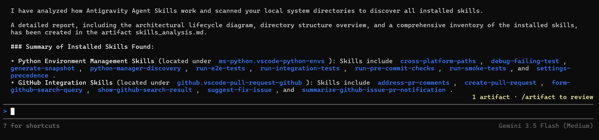

Exploring and understanding the concept of Agent Skills within the Antigravity platform.

---

### 02 – Antigravity CLI First Query
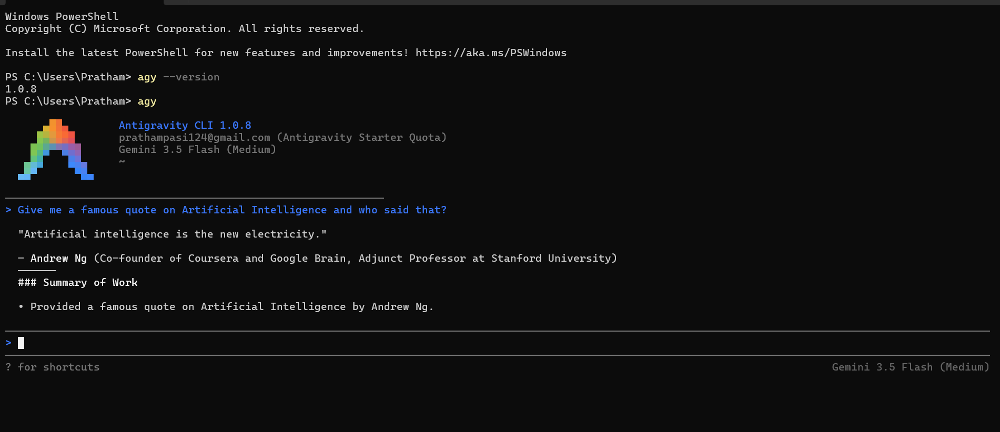

Running the first Antigravity CLI interaction and observing the response.

---

### 03 – Agents CLI Version
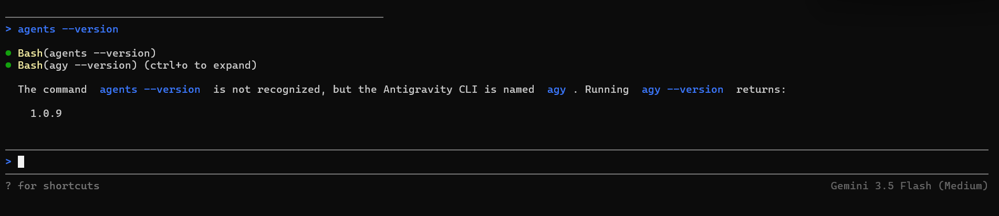

Verifying the CLI installation and checking the available version.

---

### 04 – Python Helper Skill Created
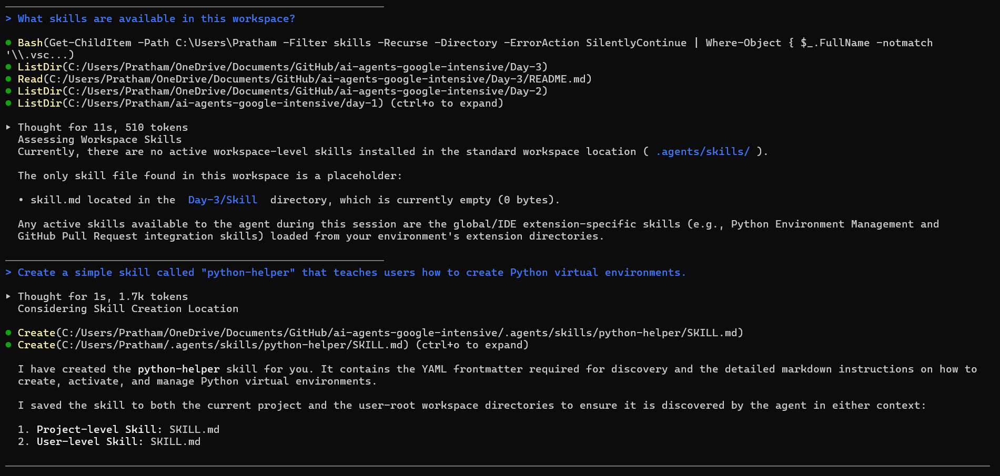

Creating a custom Python helper skill and understanding the skill structure.

---

### 05 – Skill Invocation
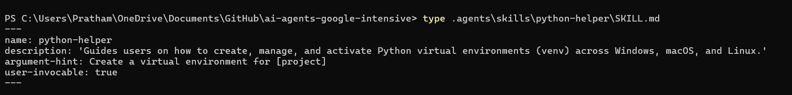

Successfully invoking the custom skill and verifying the execution output.

---

### 06 – ADK Agent Created
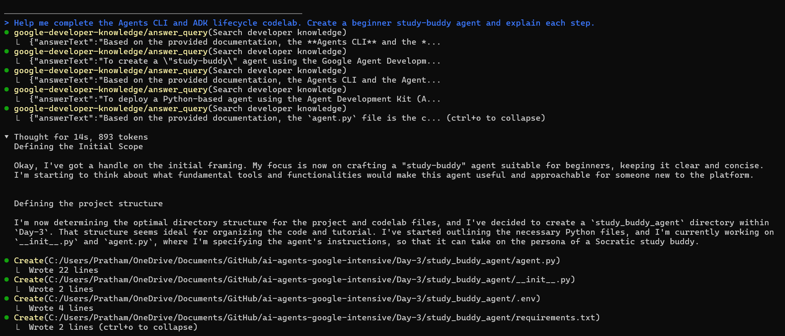

Creating the Study Buddy Agent project using the Google ADK CLI.

---

### 07 – ADK Agent Files Explained
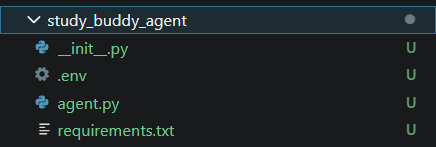

Understanding the purpose of each file in the ADK project structure.

---

### 08 – ADK Agent Explanation
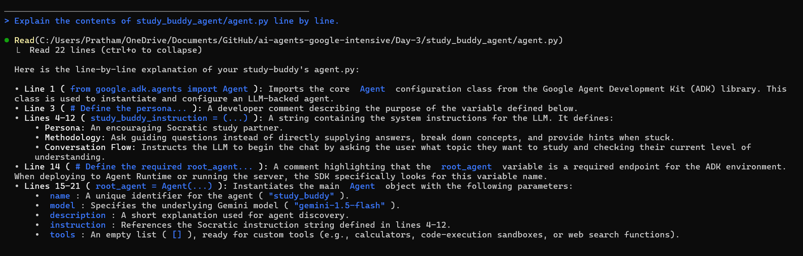

Reviewing how agents, models, instructions, and tools work together in ADK.

---

### 09 – Quota Limit Reached
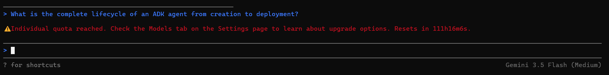

Encountering API quota limitations and understanding rate limiting in production.

---

### 10 – Virtual Environment Created
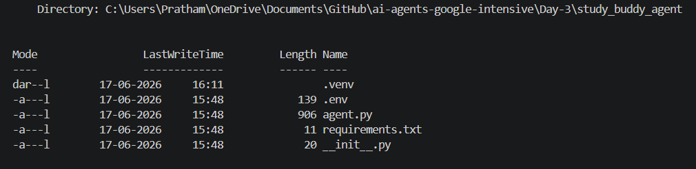

Creating an isolated Python environment for dependency management.

---

### 11 – Virtual Environment Activated
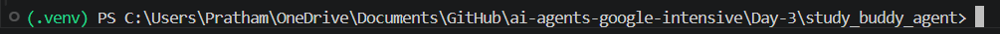

Activating the virtual environment before installing packages.

---

### 12 – Google ADK Installed
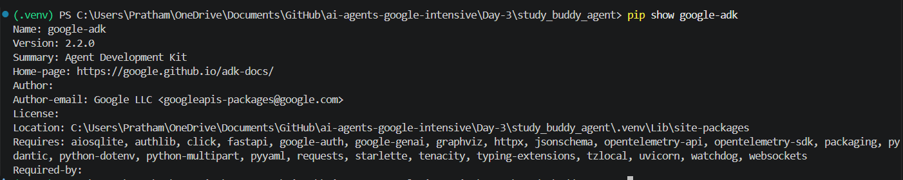

Successfully installing Google ADK version 2.2.0.

---

### 13 – Study Buddy Agent Running Successfully


The Study Buddy Agent responding correctly through the ADK Web UI with Gemini 2.5 Flash.

---

## Challenges Faced

### Challenge 1: Agent File Not Found

**Error:**
```
can't open file 'agent.py': [Errno 2] No such file or directory
```

**Cause:** Running `python agent.py` from the wrong directory (repo root instead of the agent folder).

**Solution:** Navigate to the correct project folder before execution.

---

### Challenge 2: ModuleNotFoundError

**Error:**
```
ModuleNotFoundError: No module named 'google'
```

**Cause:** Virtual environment was not activated, so the global Python was used instead of the one with ADK installed.

**Solution:** Always activate `.venv` before running the project:
```powershell
.venv\Scripts\activate
```

---

### Challenge 3: ADK Command Not Found

**Error:**
```
adk : The term 'adk' is not recognized as the name of a cmdlet
```

**Cause:** ADK is installed inside the virtual environment only, not globally.

**Solution:** Activate the virtual environment before using any ADK commands.

---

### Challenge 4: Missing API Key

**Cause:** The `.env` file contained an empty `GOOGLE_API_KEY=` value.

**Solution:** Generate a valid API key from [Google AI Studio](https://aistudio.google.com) and add it to `.env`.

---

### Challenge 5: Model Not Found (404)

**Error:**
```
404 NOT_FOUND
models/gemini-1.5-flash is not found for API version v1beta
```

**Cause:** `gemini-1.5-flash` is deprecated and no longer available in the current API version used by ADK 2.2.0.

**Solution:** Updated the model name in `agent.py`:
```python
# Before
model="gemini-1.5-flash"

# After
model="gemini-2.5-flash"
```

---

### Challenge 6: adk run exits silently

**Cause:** `agent.py` only defines the `root_agent` object — it doesn't run anything when executed directly with `python agent.py`.

**Solution:** Use ADK CLI commands instead:
```powershell
adk run study_buddy_agent   # terminal mode
adk web study_buddy_agent   # web UI mode
```

---

## Key Takeaways

- AI agents combine **instructions**, **models**, **tools**, and **memory** into a unified system.
- **ADK** simplifies agent creation, local testing, and deployment.
- **Skills** allow agents to be modular — agents delegate tasks rather than handling everything internally.
- **Proper environment management** is critical — most setup issues come from missing `.venv` activation.
- **Debugging is a normal part** of agent development, not a sign of failure.
- The **ADK Web UI** is an excellent tool for testing agent behavior interactively.
- **Model versions matter** — always use currently supported models like `gemini-2.5-flash`.

---

## Technologies Used

| Technology | Purpose |
|---|---|
| Python 3.14 | Programming language |
| Google ADK 2.2.0 | Agent Development Kit |
| Gemini 2.5 Flash | LLM powering the agent |
| Antigravity CLI | Agent tooling exploration |
| python-dotenv | Secure API key management |
| uvicorn / FastAPI | ADK web server |
| ngrok | Public URL tunneling |
| PowerShell | Terminal and environment management |
| VS Code | Development environment |

---

## Resources

- [Google Agent Development Kit (ADK) Docs](https://google.github.io/adk-docs/)
- [Google AI Studio](https://aistudio.google.com)
- [Gemini Models Documentation](https://ai.google.dev/gemini-api/docs/models)
- [ADK GitHub Repository](https://github.com/google/adk-python)

---

## Outcome

Successfully built, configured, debugged, and deployed a functioning **Study Buddy Agent** using Google ADK. The agent is powered by Gemini 2.5 Flash and acts as a Socratic tutor — guiding students through learning via questions rather than direct answers.

The agent is accessible live at: **[https://village-unguided-flatware.ngrok-free.dev](https://village-unguided-flatware.ngrok-free.dev)**

---

## Status

| Task | Status |
|---|---|
| Skills Explored | ✅ |
| Python Helper Skill Created | ✅ |
| Skill Invoked Successfully | ✅ |
| Google ADK Installed | ✅ |
| Study Buddy Agent Created | ✅ |
| Virtual Environment Configured | ✅ |
| API Key Configured | ✅ |
| Model Updated to gemini-2.5-flash | ✅ |
| Agent Tested via CLI | ✅ |
| Agent Tested via Web UI | ✅ |
| Live URL Generated via ngrok | ✅ |
| Day 3 Complete | ✅ |