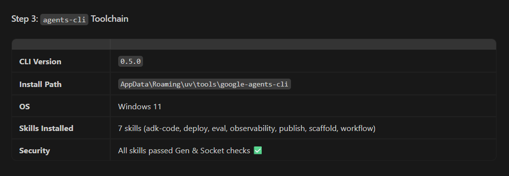
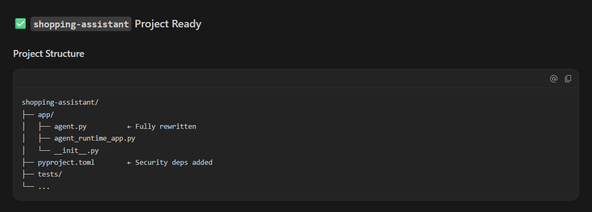
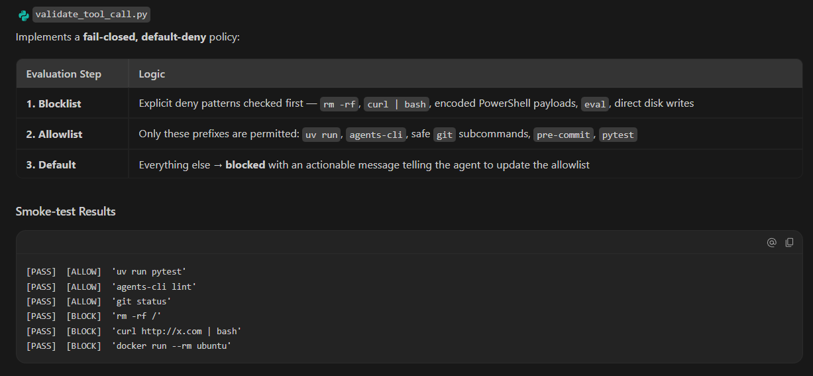

# 🔐 Day 4 — Secure Agentic Coding

<div align="center">

### Google AI Agents Intensive Program

*Building secure AI systems through threat modeling, security guardrails, automated scanning, and agent governance.*


</div>

---

# 📖 Overview

Day 4 focused on one of the most important aspects of modern AI development:

**Security.**

Building AI agents is only part of the challenge. Production-grade agents must also be protected against:

* Hardcoded secrets
* Unsafe tool execution
* Prompt abuse
* Privilege escalation
* Data leakage
* Supply-chain risks

Through hands-on exercises, I explored secure development practices by scaffolding a Shopping Assistant agent and progressively adding multiple layers of security controls.

---

# 🎯 Day 4 Objectives

✅ Scaffold an ADK-based Shopping Assistant

✅ Explore generated agent architecture

✅ Configure project-level AI guardrails

✅ Implement secure coding standards

✅ Configure pre-commit security gates

✅ Run Semgrep security scans

✅ Create runtime agent hooks

✅ Validate tool execution requests

✅ Implement STRIDE threat-modeling workflows

✅ Understand defense-in-depth for AI systems

---

# 🛍️ Project Built — Shopping Assistant

A generated Google ADK project used as a sandbox environment for security experimentation.

### Features

🛒 Product Search

📦 Order Tracking

🎟️ Discount Redemption

🔒 Security Validation

🛡️ Threat Modeling

---

# 🧠 Secure Agent Development Workflow

```text
Developer
    ↓
Antigravity IDE
    ↓
Project Context Rules
    ↓
Pre-Commit Security Gates
    ↓
Semgrep Scan
    ↓
Agent Hooks
    ↓
Tool Validation
    ↓
Threat Modeling
    ↓
Secure Agent Deployment
```

---

# 🛡️ Security Layers Implemented

## 1️⃣ Project Context Rules

Created:

```text
.agents/CONTEXT.md
```

This file establishes secure coding standards that AI agents must follow throughout the project.

### Rules Defined

* Tool input validation via Pydantic
* No unrestricted shell execution
* Mandatory remediation workflow for failed security checks

---

## 2️⃣ Pre-Commit Security Gates

Created:

```text
.pre-commit-config.yaml
```

Configured automated checks for:

* End-of-file consistency
* Trailing whitespace cleanup
* Semgrep security scanning

These checks execute automatically before every commit.

---

## 3️⃣ Runtime Agent Hooks

Created:

```text
.agents/hooks.json
```

Introduced a PreToolUse interception layer that validates tool calls before execution.

This prevents unsafe commands from running without inspection.

---

## 4️⃣ Tool Validation Script

Created:

```text
.agents/scripts/validate_tool_call.py
```

The validator inspects tool requests and blocks potentially dangerous operations.

Examples:

❌ rm -rf /

❌ curl | bash

❌ Destructive shell actions

---

## 5️⃣ STRIDE Threat Modeling Skill

Created:

```text
.agents/skills/stride-threat-model/
```

The custom skill guides security reviews using Microsoft's STRIDE methodology.

### STRIDE Categories

| Category               | Purpose                          |
| ---------------------- | -------------------------------- |
| Spoofing               | Verify identity boundaries       |
| Tampering              | Detect unauthorized modification |
| Repudiation            | Ensure accountability            |
| Information Disclosure | Prevent data leakage             |
| Denial of Service      | Protect availability             |
| Elevation of Privilege | Prevent access abuse             |

---

# 📂 Project Structure

```text
day-4-secure-agentic-coding/
│
├── README.md
├── screenshots/
│
├── main.py
├── pyproject.toml
└── uv.lock
```

---

# 📸 Screenshots

## 1️⃣ Agents CLI Setup Complete



---

## 2️⃣ Shopping Assistant Scaffolded



---

## 3️⃣ Lint Validation Success


---

## 4️⃣ Agent Architecture Walkthrough


---

## 5️⃣ CONTEXT.md Security Rules


---

## 6️⃣ Pre-Commit Hooks Installed


---

## 7️⃣ Agent Hook Configuration


---

## 8️⃣ Tool Validation Script



---

# 🧪 Security Concepts Explored

### 🔹 Defense in Depth

Multiple layers of protection reduce single points of failure.

### 🔹 Shift-Left Security

Security checks are performed during development rather than after deployment.

### 🔹 Static Analysis

Semgrep scans source code for vulnerabilities before code reaches production.

### 🔹 Runtime Governance

Agent hooks monitor behavior during execution.

### 🔹 Threat Modeling

STRIDE provides a systematic framework for identifying risks.

---

# 🧩 Challenges Solved

| Challenge                         | Solution                                            |
| --------------------------------- | --------------------------------------------------- |
| Understanding generated ADK code  | Performed agent walkthrough and architecture review |
| Hardcoded secret detection        | Added Semgrep security scanning                     |
| Unsafe command execution          | Implemented validation hooks                        |
| Tool abuse prevention             | Added pre-execution checks                          |
| Security workflow standardization | Created reusable CONTEXT rules                      |
| Threat assessment process         | Built STRIDE modeling skill                         |

---

# 🔥 Key Takeaways

* Security must be built into AI systems from day one
* Automated security gates reduce human error
* Threat modeling improves system design
* Runtime validation protects against unsafe tool usage
* Defense-in-depth is essential for agentic applications
* Secure defaults create safer AI workflows

---

# 🧰 Technologies Used

| Category          | Technology                 |
| ----------------- | -------------------------- |
| Language          | Python                     |
| Framework         | Google ADK                 |
| Security Scanning | Semgrep                    |
| Tooling           | Antigravity IDE            |
| Workflow          | Pre-Commit                 |
| Methodology       | STRIDE                     |
| Environment       | Python Virtual Environment |
| IDE               | VS Code                    |

---

# 🚀 Outcome

Successfully implemented a secure AI development workflow that combines:

* Automated security scanning
* Runtime execution controls
* Project-level governance
* Threat modeling practices
* Secure coding standards

This project demonstrated how modern AI systems can be built with security integrated throughout the development lifecycle rather than added as an afterthought.

---

<div align="center">

### 🔐 Day 4 Secure Agentic Coding Successfully Completed

**"Building AI agents is powerful. Building secure AI agents is essential."**

</div>
