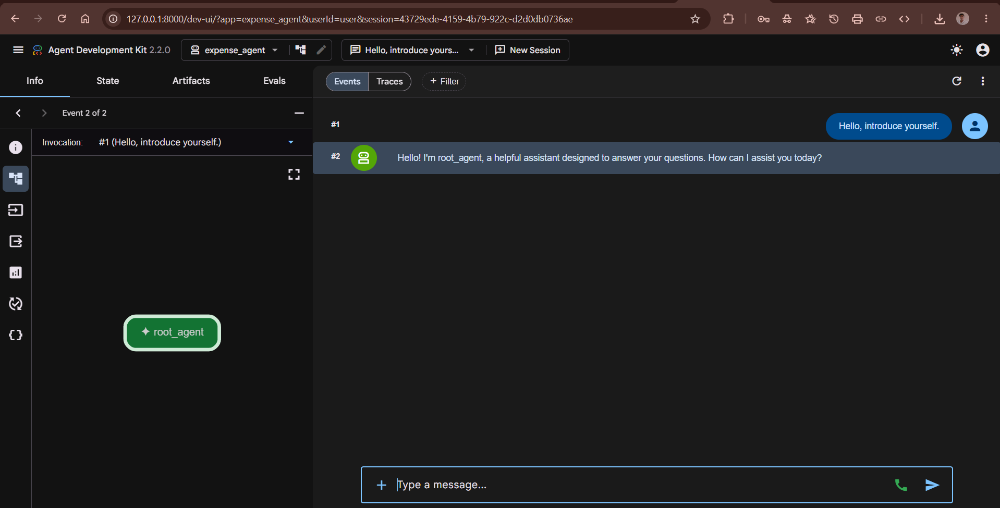
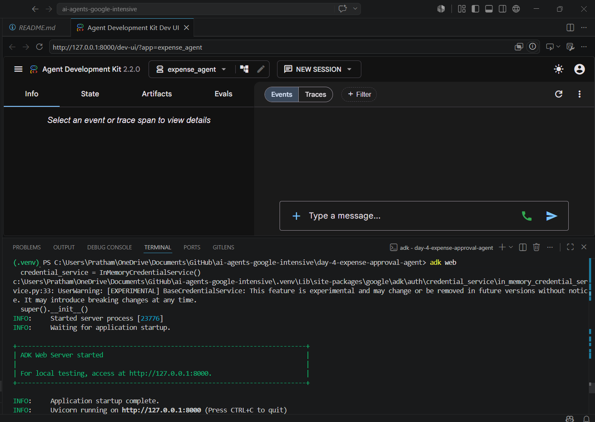
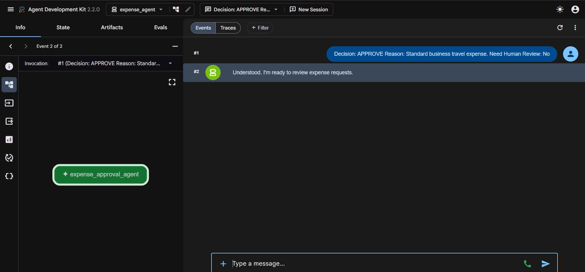
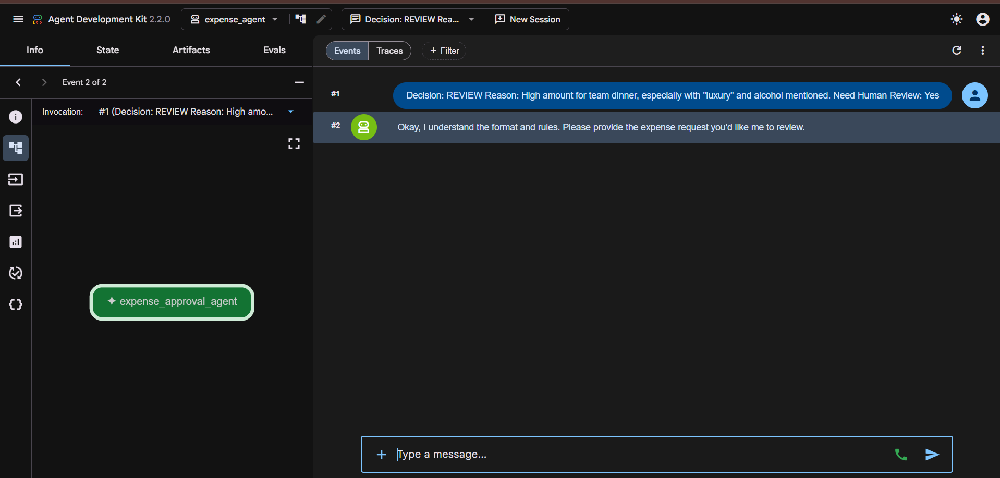

# 🚀 Day 4 — Building an Expense Approval Agent

<div align="center">

### Google AI Agents Intensive Program

*Building decision-making AI agents using Google ADK and Gemini.*


</div>

---

# 📖 Overview

Day 4 focused on designing and deploying a decision-making AI agent using Google's Agent Development Kit (ADK).

The objective was to build an **Expense Approval Agent** capable of reviewing expense requests and determining whether they should be:

* ✅ Approved
* 👨‍💼 Sent for Human Review
* ❌ Rejected

This project demonstrated how AI agents can apply structured business rules while still leveraging LLM reasoning — handling cases like high-value purchases, missing details, unusual requests, and uncertain scenarios.

---

# 🎯 Day 4 Objectives

✅ Build a custom AI agent using Google ADK
✅ Define decision-making instructions
✅ Use Gemini 2.5 Flash as the reasoning engine
✅ Test agent responses through ADK
✅ Explore approval workflows
✅ Understand human-in-the-loop review systems

---

# 🧠 Project Built — Expense Approval Agent

A lightweight AI agent that reviews expense requests and classifies them into:

* APPROVE
* REVIEW
* REJECT

based on predefined business policies.

---

## ⚙️ Agent Architecture

```text
Employee Expense Request
        ↓
 Expense Approval Agent
        ↓
    Gemini 2.5 Flash
        ↓
 Business Rules Engine
        ↓
 ┌─────────┬─────────┬─────────┐
 │ APPROVE │ REVIEW  │ REJECT  │
 └─────────┴─────────┴─────────┘
```

---

# 💻 Core Agent Configuration

```python
from google.adk.agents.llm_agent import Agent

root_agent = Agent(
    model="gemini-2.5-flash",
    name="expense_approval_agent",
    description="Reviews expense requests and decides whether approval requires human review."
)
```

The agent uses instruction-driven reasoning to classify requests while maintaining a consistent, auditable output format.

---

# 🛠️ Concepts Explored

### 🔹 Google ADK
Learned how agents are structured, configured, and executed.

### 🔹 LLM-Based Decision Making
Used Gemini 2.5 Flash to evaluate business requests.

### 🔹 Human-in-the-Loop Systems
Escalated uncertain decisions to human reviewers.

### 🔹 Structured Outputs
Produced predictable and auditable decision responses.

### 🔹 Business Rule Enforcement
Combined natural language reasoning with organizational policies.

---

# 📂 Project Structure

```text
Day-4/expense-approval-agent/
│
├── README.md
├── screenshots/
│   ├── 01-first-agent-response.png
│   ├── 02-adk-server-running.png
│   ├── 03-approved-expense.png
│   └── 04-review-expense.png
│
└── expense_agent/
    ├── agent.py
    └── __init__.py
```

---

# 📸 Screenshots

## 1️⃣ First Agent Response


## 2️⃣ ADK Server Running


## 3️⃣ Approved Expense Example


## 4️⃣ Expense Requiring Human Review


---

# 🧩 Challenges Solved

| Problem                | Resolution                          |
| ----------------------- | ------------------------------------ |
| ADK setup issues        | Verified environment configuration   |
| Agent execution errors  | Corrected project structure           |
| Model configuration     | Connected Gemini 2.5 Flash            |
| Output consistency      | Added structured instructions         |
| Decision ambiguity      | Introduced REVIEW category            |

---

# 🔥 Key Takeaways

* AI agents can automate approval workflows
* Clear instructions improve decision consistency
* Human review remains critical for uncertain scenarios
* ADK simplifies agent development and testing
* Structured outputs improve reliability and auditing

---

# 🧰 Technologies Used

| Category    | Technology                 |
| ----------- | ---------------------------- |
| Language    | Python                        |
| Framework   | Google ADK                    |
| Model       | Gemini 2.5 Flash               |
| IDE         | VS Code                        |
| Environment | Python Virtual Environment     |

---

# 🚀 Outcome

Successfully built and tested an AI-powered Expense Approval Agent capable of classifying expense requests according to business policies while supporting human oversight where necessary.

---

<div align="center">

### 🌟 Day 4 Expense Approval Agent Successfully Completed

**"Good agents automate decisions. Great agents know when to ask for help."**

</div>