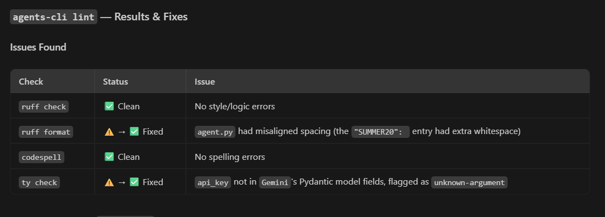
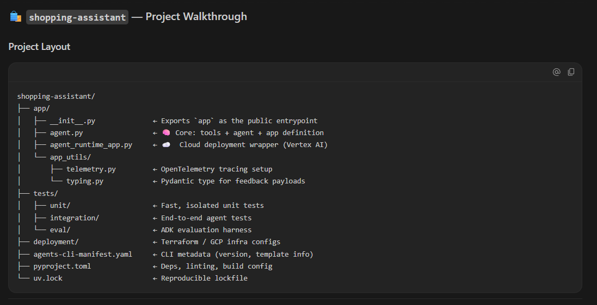
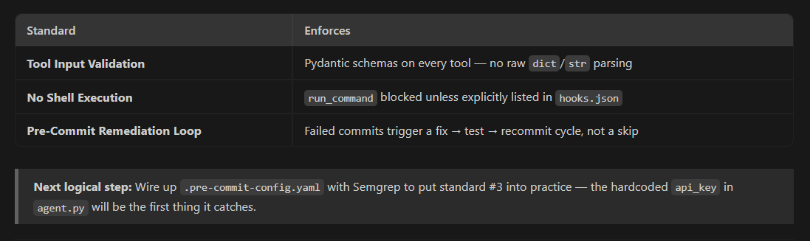
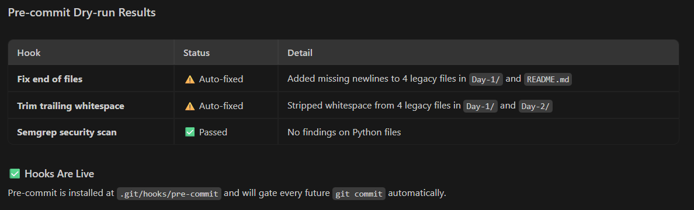
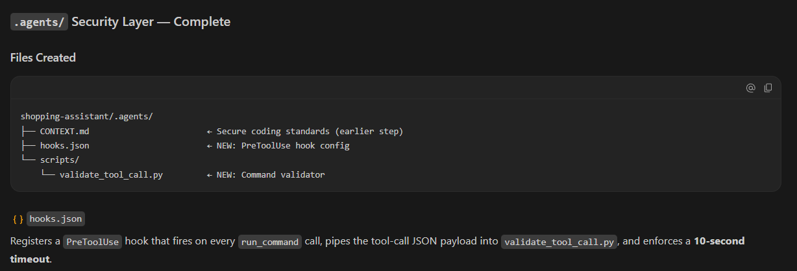

<div align="center">

# 🚀 Day 4 — Secure Agentic Coding

### Google AI Agents Intensive Program

*Hardening an AI-generated agent with project-level security rules, automated scanning, and runtime validation.*


</div>

---

# 📖 Overview

Day 4's second track shifted focus from *building* agents to **securing** them.

AI coding agents can generate working code quickly, but speed without guardrails creates real risk: unreviewed tool calls, unsafe file access, and unvetted dependencies. This session took a scaffolded **Shopping Assistant** ReAct agent and hardened it end-to-end — combining project-level security context, automated static analysis, and runtime validation hooks.

---

# 🎯 Day 4 Objectives

✅ Understand secure agentic coding principles
✅ Scaffold an agent using `agents-cli`
✅ Define project security rules with a `CONTEXT.md` file
✅ Apply STRIDE threat modeling to an agent's tool surface
✅ Set up pre-commit Semgrep scanning
✅ Build runtime tool-call validation hooks
✅ Document the secure development workflow

---

# 🧠 Project Hardened — Shopping Assistant Agent

A ReAct-style agent (scaffolded with `agents-cli`) supporting product search, order tracking, and discount redemption — used as the security sandbox for this session.

📁 The hardened agent itself lives at [`shopping-assistant`](../../shopping-assistant) in the repo root.

### Security Layers Added

🛡️ **Project Context Rules** — a `CONTEXT.md` defining safe-coding constraints for any AI agent contributing to the codebase

🔍 **Pre-commit Semgrep Scanning** — static analysis run automatically before every commit to catch common vulnerability patterns

🪝 **Tool-Call Validation Hooks** — runtime checks that intercept and validate agent tool calls before execution

🧩 **STRIDE Threat-Modeling Skill** — a reusable skill applied to systematically identify Spoofing, Tampering, Repudiation, Information Disclosure, Denial of Service, and Elevation of Privilege risks in the agent's design

---

## ⚙️ Security Workflow

```text
Agent Scaffolded (agents-cli)
        ↓
CONTEXT.md (project security rules)
        ↓
STRIDE Threat Model Applied
        ↓
Pre-commit Hook Installed (Semgrep)
        ↓
Tool-Call Validation Hook
        ↓
Hardened, Commit-Ready Agent
```

---

# 🛠️ Concepts Explored

### 🔹 Secure Agentic Coding

Treating AI-generated code with the same scrutiny as human-written code — review, scan, and validate before trusting it.

### 🔹 STRIDE Threat Modeling

A structured framework for reasoning about what could go wrong in an agent's tool access, data flow, and permissions.

### 🔹 Static Analysis with Semgrep

Automated pattern-based scanning integrated into the commit workflow to catch issues before they reach the repo.

### 🔹 Runtime Validation Hooks

Intercepting and validating tool calls at execution time, not just at code-review time — catching issues that only appear at runtime.

### 🔹 Project-Level Security Context

Using a `CONTEXT.md` file to give any AI coding agent working in the repo a consistent set of security constraints to follow.

---

# 📂 Project Structure

```text
Day-4/secure-agentic-coding/
│
├── README.md
├── .python-version
├── pyproject.toml
├── uv.lock
├── main.py
└── screenshots/
```

---

# 📸 Screenshots

## 1️⃣ agents-cli Setup Complete


---

## 2️⃣ Shopping Assistant Scaffolded


---

## 3️⃣ Lint Success



---

## 4️⃣ Agent Walkthrough



---

## 5️⃣ CONTEXT.md Created



---

## 6️⃣ Pre-commit Hooks Installed



---

## 7️⃣ Agent Hooks JSON



---

## 8️⃣ Validate Tool-Call Script


---

# 🧩 Challenges Solved

| Problem                                   | Resolution                                          |
| ------------------------------------------ | ---------------------------------------------------- |
| No security baseline for agent-generated code | Authored a `CONTEXT.md` with explicit security rules |
| Vulnerable patterns slipping into commits | Installed Semgrep as a pre-commit hook               |
| Unvalidated tool calls at runtime          | Built a tool-call validation hook script             |
| Unstructured risk assessment               | Applied STRIDE threat modeling systematically        |

---

# 🔥 Key Takeaways

* AI-generated code needs the same security discipline as hand-written code
* STRIDE gives a repeatable structure for reasoning about agent risk
* Pre-commit scanning catches issues before they ever reach version control
* Runtime validation hooks close gaps that static analysis alone can't catch
* Security context files let any agent (human or AI) work within the same guardrails

---

# 🧰 Technologies Used

| Category         | Technology                  |
| ----------------- | ---------------------------- |
| Language          | Python                      |
| Agent Scaffolding | `agents-cli`                 |
| Static Analysis   | Semgrep                     |
| Threat Modeling   | STRIDE                      |
| Workflow          | pre-commit hooks            |
| Package Manager   | `uv`                         |
| IDE                | VS Code                     |

---

# 🚀 Outcome

Successfully scaffolded a ReAct shopping assistant agent and hardened it with a layered security workflow — project-level rules, threat modeling, static analysis, and runtime validation — turning a quick AI-generated prototype into a commit-ready, security-reviewed agent.

---

<div align="center">

### 🌟 Day 4 Secure Agentic Coding Successfully Completed

**"Fast AI-generated code is only as good as the guardrails built around it."**

</div>