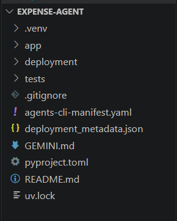
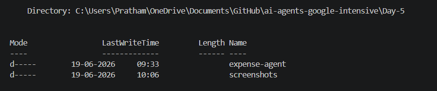
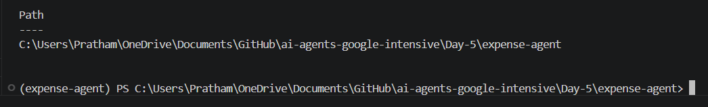
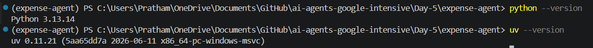
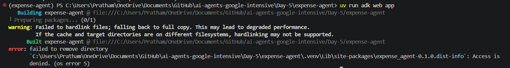
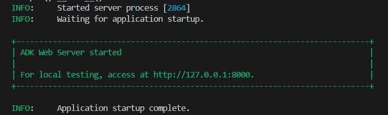
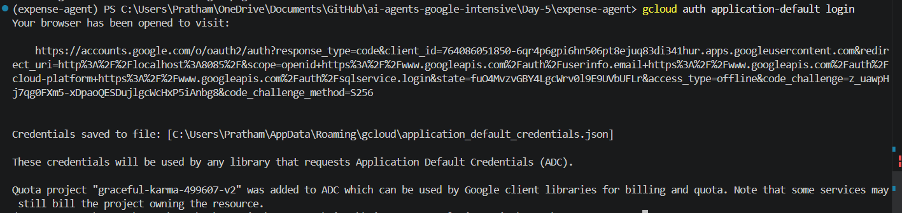
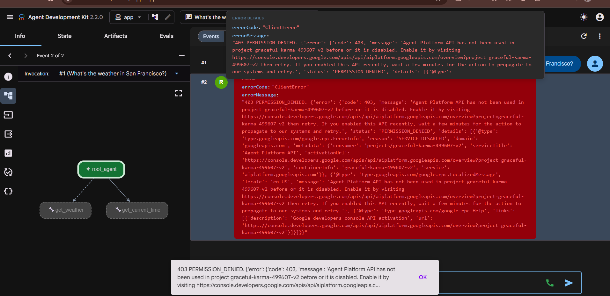
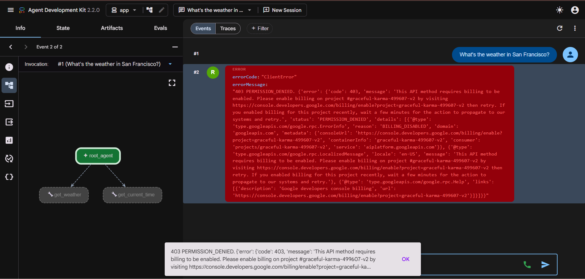

# 🚀 Day 5 — Setting Up an Expense Agent with Google ADK

<div align="center">

### Google AI Agents Intensive Program

*Building AI-powered applications using Google Agent Development Kit (ADK) and Gemini.*


</div>

---

# 📖 Overview

Day 5 focused on setting up a production-style Expense Agent project using Google's Agent Development Kit (ADK).

The objective was to initialize the agent environment, configure Google Cloud authentication, launch the ADK web interface, and understand the infrastructure required to run Gemini-powered agents.

This session provided hands-on experience with agent deployment prerequisites, authentication workflows, and debugging common setup issues encountered during real-world AI development.

---

# 🎯 Learning Objectives

✅ Set up a Google ADK project

✅ Create and manage Python virtual environments with UV

✅ Configure Application Default Credentials (ADC)

✅ Understand Google Cloud authentication flows

✅ Launch and interact with the ADK Web UI

✅ Debug authentication and API permission issues

✅ Explore agent architecture and tool integration

---

# 🧠 Project Built — Expense Agent Setup

The project includes a Google ADK-based Expense Agent capable of using Gemini models and custom tools.

### Included Agent Tools

#### 🌦️ Weather Tool

Provides simulated weather information.

#### 🕒 Time Tool

Returns timezone-aware current time information.

#### 🤖 Gemini Integration

Uses Gemini Flash as the reasoning engine through Google ADK.

---

# ⚙️ Agent Architecture

```text
User Query
      ↓
Expense Agent
      ↓
Google ADK
      ↓
Gemini Flash Model
      ↓
Tool Execution Layer
      ↓
Weather / Time Tools
      ↓
Agent Response
```

---

# 💻 Core Technologies

```python
root_agent = Agent(
    name="root_agent",
    model=Gemini(
        model="gemini-flash-latest"
    ),
    tools=[
        get_weather,
        get_current_time
    ]
)
```

The agent combines Gemini reasoning with callable Python tools to generate responses.

---

# 🛠️ Concepts Explored

### 🔹 Google ADK

Learned how agents are structured and executed using the Agent Development Kit.

### 🔹 Application Default Credentials (ADC)

Configured Google Cloud authentication using:

```bash
gcloud auth application-default login
```

### 🔹 Agent Web Interface

Launched the ADK web environment for testing and debugging agents.

### 🔹 Tool Calling

Explored how Gemini agents can invoke Python functions as tools.

### 🔹 Cloud Authentication

Debugged credential, permission, and API access issues.

---

# 📂 Project Structure

```text
Day-5/
│
├── expense-agent/
│   ├── app/
│   │   ├── agent.py
│   │   ├── agent_runtime_app.py
│   │   └── app_utils/
│   │
│   ├── deployment/
│   ├── tests/
│   ├── pyproject.toml
│   ├── uv.lock
│   └── README.md
│
└── screenshots/
```

---

# 📸 Screenshots

## 1️⃣ Expense Agent Project Structure



---

## 2️⃣ Day 5 Folder Structure



---

## 3️⃣ Expense Agent Working Directory



---

## 4️⃣ Python & UV Verification



---

## 5️⃣ ADK Startup Error After Project Move



This issue occurred after moving the project directory and required recreating the virtual environment and reinstalling dependencies.

---

## 6️⃣ ADK Server Running Successfully



The ADK web interface launched successfully and became accessible through localhost.

---

## 7️⃣ Google Cloud ADC Login Success



Successfully configured Application Default Credentials (ADC) using Google Cloud CLI.

---

## 8️⃣ Agent Platform API Disabled Error



While testing the agent, Google Cloud reported that the Agent Platform API had not yet been enabled for the configured project.

---

## 9️⃣ Billing Required Error



After enabling the required API, the project encountered a billing requirement restriction, highlighting an important deployment prerequisite for Vertex AI and Agent Platform services.

---

## 🎯 Learning Objectives

✅ Diagnose API permission and service activation errors

✅ Understand billing requirements for Vertex AI services

---

# 🧩 Challenges Solved

| Problem                                       | Resolution                                             |
| --------------------------------------------- | ------------------------------------------------------ |
| Broken virtual environment after project move | Recreated the UV environment                           |
| Missing Python dependencies                   | Reinstalled project requirements                       |
| ADK startup failures                          | Verified project structure and environment             |
| Missing Application Default Credentials       | Configured ADC using gcloud                            |
| Authentication errors                         | Validated Google Cloud login configuration             |
| Port conflicts on localhost                   | Identified existing ADK process and resolved conflicts |

---

# 🔥 Key Takeaways

* Google ADK simplifies AI agent development
* Authentication is a critical part of agent deployment
* Application Default Credentials are required for Google Cloud integrations
* Tool calling enables agents to interact with Python functions
* Debugging infrastructure issues is an essential AI engineering skill
* Proper project structure prevents many runtime errors

---

# 🧰 Technologies Used

| Category        | Technology                      |
| --------------- | ------------------------------- |
| Language        | Python 3.13                     |
| Framework       | Google ADK 2.2.0                |
| Model           | Gemini Flash                    |
| Package Manager | UV                              |
| Cloud Platform  | Google Cloud                    |
| Authentication  | Application Default Credentials |
| IDE             | VS Code                         |

---

# 🚀 Outcome

Successfully initialized and configured a Google ADK Expense Agent project, authenticated with Google Cloud using ADC, launched the ADK web interface, and resolved multiple environment and authentication issues.

The project is now prepared for future agent development and deployment activities.

---

<div align="center">

### 🌟 Day 5 Expense Agent Environment Successfully Configured

**"Before intelligent agents can solve problems, the infrastructure powering them must be built correctly."**

</div>
